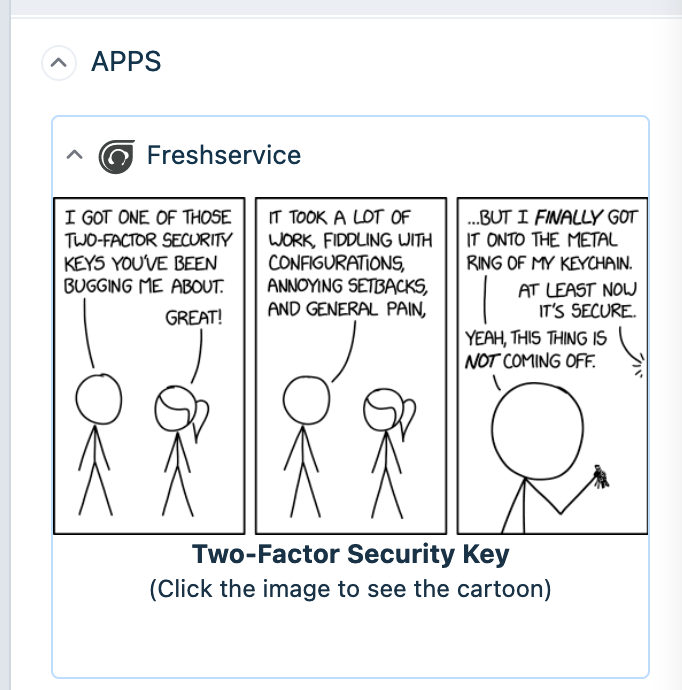
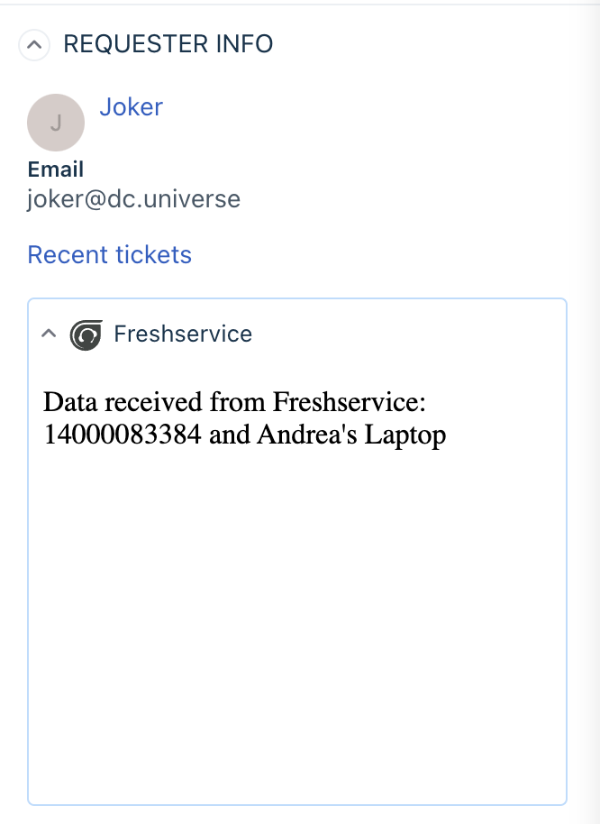

# Request Method for Freshservice

Request Method enables apps to make API requests to third-party applications using [Request templates](../UserGuide.md)




## Features Demonstrated

App location: ticket details page

| Feature | Notes |
| :---: | --- |
| [`Request methods`](../UserGuide.md) | Request API is used to facilitate third-party API requests |

## Prerequisites

1. Make sure you have a trial Freshservice account created. You can always [sign up](https://freshservice.com/signup)
2. Ensure that you have the [Freshworks CLI](https://community.developers.freshworks.com/t/what-are-the-prerequisites-to-install-the-freshworks-cli/234) installed properly.

### Procedure to run the app

```sh
# Run the app
> fdk run
# You will need to append ?dev=true in the URL on every page.
# see browser console for a log from relavant app placeholder
```
