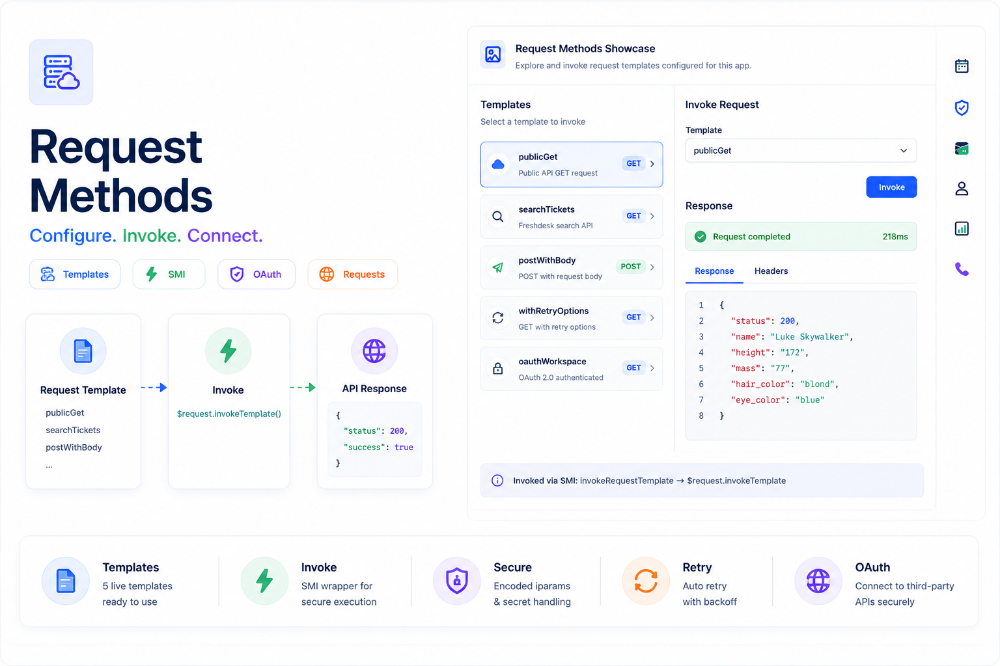

<p align="center">
  
</p>

# Nexus Connect Hub — Request Method Samples

A Freshworks Platform 3.0 sample app that teaches **Request Methods** through real integration scenarios — partner webhooks, account sync, priority search, health checks, and resilient lookups — the way **Nexus API Labs** ships client connectors.

The full-page **Integration Ops Center** maps each client workflow to a `requests.json` template with **Run integration** drills. The ticket **Quick Connect** sidebar builds payloads from `client.data.get('ticket')` and invokes through SMI. A collapsible **Developer playbook** holds schema tables and platform limits for engineers. See [`usecase.md`](usecase.md) for Nexus operational scenarios.

## Description

Nexus API Labs integrates Freshdesk with partner CRMs, billing APIs, and webhooks. Instead of a dry API catalog, this app presents **scenario cards** — each card tells a client story, shows the template key, and runs a live server-side invoke. New engineers learn *why* a pattern exists before opening the playbook reference tables.

Scenario metadata lives in `request-objects.js`; cards and sidebar actions are rendered by `render-catalog.js`.

### Core Functionality

1. **Integration Ops Center (full page)** — scenario card grid for five live client workflows plus future-pattern reference cards
2. **Quick Connect (ticket sidebar)** — ticket context banner + one-click integration drills with ticket-derived payloads
3. **SMI invoke wrapper** — `invokeRequestTemplate` routes all live drills through serverless `$request.invokeTemplate`
4. **Developer playbook** — collapsed accordion with limits, schema, substitutions, errors, and allow-list IPs
5. **Front-end cache demo** — partner status lookup with `cache` and `ttl` (teaching panel inside playbook)
6. **Vitest coverage** — `request-kit.js`, `request-objects.js` catalog completeness, and `server.js` SMI handler

## Features

- **Five live integration scenarios** — each maps a Nexus client workflow to a template key with colored badge, story text, and formatted response panel
- **Ticket-aware sidebar** — webhook body includes ticket id, subject, priority; search query uses current ticket priority
- **Run integration + Copy server code** — every scenario card invokes via SMI and copies `$request.invokeTemplate` sample
- **Future client patterns** — CRM upload, OAuth, TLS reference cards (not live in Freshdesk)
- **Iparam-driven Freshdesk calls** — account sync and search use `encode(iparam.api_key)` — keys never reach browser code
- **Themed Nexus branding** — hero header, scenario accents, and Quick Connect layout (similar spirit to Agent Huddle sticky notes)

## User Interfaces

| Surface | Placement | Behavior |
| --- | --- | --- |
| `app/full_page.html` | `common.full_page_app` | **Integration Ops Center** — scenario card grid + developer playbook |
| `app/sidebar.html` | `support_ticket.ticket_sidebar` | **Quick Connect** — ticket context + integration action buttons |

### Scenario → template mapping

| Scenario (UI) | Template key | Nexus client workflow |
| --- | --- | --- |
| Partner webhook notify | `postWithBody` | POST ticket event JSON to partner webhook at invoke time |
| Priority escalation search | `searchTickets` | Freshdesk search API with dynamic `context.query` |
| Account ticket sync | `iparamHostGet` | List tickets via iparam subdomain + secure API key |
| Partner API health check | `publicGet` | Runtime host/path substitution for partner endpoint probe |
| Resilient partner lookup | `withRetryOptions` | Retry on transient 429/5xx with `options.maxAttempts` |

### Full-page sections

| Section | Content |
| --- | --- |
| Live integration drills | Five scenario cards with **Run integration** |
| Future client patterns | Reference JSON for upload, OAuth, TLS |
| Developer playbook (collapsed) | Platform limits, schema, substitutions, errors, caching demo |

## Platform 3.0 Features Used

### 1. Request Methods — Template Configuration

Five templates in `config/requests.json` demonstrate host/path substitution, iparam auth, Freshdesk search, POST bodies at invoke time, and retry options:

```json
{
  "publicGet": {
    "schema": {
      "protocol": "https",
      "method": "GET",
      "host": "<%= context.host %>",
      "path": "<%= context.path %>"
    }
  }
}
```

| Template | Demonstrates |
| --- | --- |
| `publicGet` | `<%= context.host %>` and `<%= context.path %>` substitution (swapi.dev demo) |
| `iparamHostGet` | `iparam.subdomain`, `encode(iparam.api_key)`, context `per_page` query |
| `searchTickets` | Freshdesk `/api/v2/search/tickets` with `<%= context.query %>` |
| `postWithBody` | POST to httpbin.org with JSON `body` at invoke time |
| `withRetryOptions` | `options.maxAttempts` and `options.retryDelay` on transient failures |

### 2. SMI — Serverless Template Invocation

Production UIs should route sensitive API calls server-side. Scenario cards and Quick Connect call `client.request.invoke('invokeRequestTemplate', …)`:

```javascript
// app/scripts/request-kit.js
await client.request.invoke('invokeRequestTemplate', {
  templateName: 'publicGet',
  context: { host: 'swapi.dev', path: '/api/people/1' }
});
```

```javascript
// server/server.js
const result = await $request.invokeTemplate(args.templateName, {
  context: args.context || {},
  body: args.body
});
renderData(null, result);
```

### 3. Installation Parameters — Subdomain and API Key

`config/iparams.json` supplies values for template substitution at runtime:

| Iparam | Purpose |
| --- | --- |
| `subdomain` | Account subdomain for `<%= iparam.subdomain %>.freshdesk.com` host substitution |
| `api_key` | Secure key used with `encode(iparam.api_key)` in Authorization headers |
| `tls_ca` | Optional PEM for `options.security.ca` TLS troubleshooting |

```json
"headers": {
  "Authorization": "Basic <%= encode(iparam.api_key) %>"
}
```

### 4. Front-End `invokeTemplate` and Response Caching

The catalog includes a **Front-end response caching** panel that calls `client.request.invokeTemplate` directly with `cache: true` and `ttl: 60000`. This is valid for teaching front-end caching behavior; production apps with secrets should still prefer SMI.

```javascript
client.request.invokeTemplate('publicGet', {
  context: { host: 'swapi.dev', path: '/api/people/1' },
  cache: true,
  ttl: 60000
});
```

**Note:** Request method calls from the front end are not supported in end-user production apps. This showcase uses SMI for live demos and isolates direct `invokeTemplate` to the caching panel only.

### 5. Crayons UI Components

The catalog uses Freshworks Crayons v4 (see `catalog-helpers.js` and `render-catalog.js`):

| Component | Usage |
| --- | --- |
| `<fw-accordion>` | Collapsible reference panels and live template sections |
| `<fw-button>` | Invoke (SMI), Copy sample, Invoke with cache |
| `<fw-spinner>` | Loading state while catalog mounts |

## Project Structure

```
├── app/
│   ├── full_page.html              # Request method reference catalog (primary surface)
│   ├── sidebar.html                # Ticket sidebar pointer to full-page catalog
│   ├── scripts/
│   │   ├── request-objects.js      # Platform limits, schema, substitutions, templates
│   │   ├── request-kit.js          # SMI invoke, direct invoke, cache helpers
│   │   ├── render-catalog.js       # Accordion panels + Invoke buttons
│   │   ├── catalog-helpers.js      # Shared accordion/button HTML
│   │   ├── page-init.js            # app.initialized() → RequestKit.setClient()
│   │   ├── full_page.js            # Mount ops center on full-page surface
│   │   └── sidebar.js              # Ticket context + Quick Connect actions
│   └── styles/
│       ├── style.css
│       └── images/icon.svg
├── config/
│   ├── requests.json               # Five live request templates
│   └── iparams.json
├── server/
│   └── server.js                   # SMI: invokeRequestTemplate → $request.invokeTemplate
├── tests/
│   ├── app.test.js                 # request-kit + request-objects coverage
│   └── server.test.js              # SMI handler (VM-loaded exports pattern)
├── manifest.json
├── package.json
├── usecase.md
└── readme.md
```

## Prerequisites

- [Freshworks CLI (FDK)](https://developers.freshworks.com/docs/app-sdk/v3.0/support_ticket/basic-dev-tools/freshworks-cli/) v10.1.2 or later
- Node.js v24.x
- A Freshdesk trial account with an API key for `searchTickets` / `iparamHostGet` demos

Enable global apps before local development:

```bash
fdk config set global_apps.enabled true
```

## Local Development

1. Install dependencies and validate:
   ```bash
   npm install
   fdk validate
   ```

2. Run locally:
   ```bash
   fdk run
   ```

3. Install the app on a Freshdesk account and configure iparams (`subdomain`, `api_key`).

4. Open surfaces with `?dev=true`:

   | Test | Where |
   | --- | --- |
   | Integration Ops Center | Left navigation → **Nexus Connect Hub** |
   | Quick Connect | Open any ticket → app in right sidebar |

5. Optional — extend request timeout for slow third-party APIs:
   ```bash
   fdk config set request.timeout 20000
   ```
   Valid values: `15000`, `20000`, `25000`, `30000` (default `15000`).

### Where to test integration drills

1. **Partner webhook notify** — Full page or sidebar; sidebar POSTs ticket id/subject/priority to httpbin.
2. **Priority escalation search** — Sidebar builds query from ticket priority; full page uses `"priority:3"`.
3. **Account ticket sync** — Requires iparams; lists one ticket from your Freshdesk account.
4. **Partner API health check** — No iparams; probes swapi.dev via context substitution.
5. **Resilient partner lookup** — GET with retry options from `requests.json`.
6. **Developer playbook** — Expand collapsed section for schema tables and cached lookup demo.

## Implementation Steps

1. **Define templates** — add HTTP schema (and optional `options`) to `config/requests.json`.
2. **Declare in manifest** — list template names under `modules.common.requests` and register SMI function `invokeRequestTemplate`.
3. **Configure iparams** — `subdomain`, secure `api_key`, optional `tls_ca` for substitution and TLS.
4. **Bootstrap client** — `page-init.js` calls `app.initialized()`, sets `RequestKit.setClient()`, dispatches `request-kit:ready`.
5. **Mount ops center** — `full_page.js` listens for `request-kit:ready` and calls `CatalogUI.mount('catalog')`.
6. **Sidebar context** — `sidebar.js` loads `client.data.get('ticket')`, mounts Quick Connect with `buildSidebarInvokeArgs`.
7. **Live invoke path** — `CatalogUI.invokeSmi` / `invokeSidebar` → `RequestKit.invokeViaSmi` → SMI → `$request.invokeTemplate`.
8. **Display results** — `RequestKit.formatResponse` pretty-prints the `response` string from the invoke result.

---

## How request method works

1. **Configure** templates in `config/requests.json` (HTTP schema + optional options).
2. **Declare** template names under `modules.common.requests` in `manifest.json`.
3. **Invoke** from serverless (`$request.invokeTemplate`) or front-end (`client.request.invokeTemplate`).

### Platform limits

| Constraint | Value |
| --- | --- |
| Request timeout | 15s default; 20–30s extends app execution to 40s |
| Rate limit | 50 requests/min per app per account |
| Request body max | 100 KB to serverless |
| Response max | 6 MB |
| Max templates | 100 in `requests.json` |

---

## config/requests.json

Each template is a JSON object keyed by `<requestTemplateName>`.

### Schema attributes

| Attribute | Required | Description |
| --- | --- | --- |
| `method` | Yes | `GET`, `POST`, `PUT`, `DELETE`, `PATCH` |
| `protocol` | No | `HTTPS` in production; `HTTP` for local testing only |
| `host` | Yes | FQDN only — no protocol, trailing slash, or IP |
| `path` | No | Resource path starting with `/` (default `/`) |
| `query` | No | Query parameters as key-value pairs |
| `headers` | No | HTTP headers (Authorization, Content-Type, etc.) |
| `formData` | No | `multipart/form-data` fields and file refs (object store) |
| `file` | No | `application/octet-stream` upload via object store ref |

**Note:** The HTTP request body is not part of the template schema; pass it at invoke time.

### Options attributes

| Option | Description |
| --- | --- |
| `maxAttempts` | Retry count on network or 429/5xx errors (1–5, default 1) |
| `retryDelay` | Milliseconds before retry (1–1500, default 1000) |
| `oauth` | OAuth config name from `config/oauth_config.json` |
| `security.ca` | PEM CA certificate for TLS chain issues |
| `security.cert` | PEM client certificate |
| `security.key` | PEM private key |
| `security.pfx` | Base64 cert+key bundle |
| `security.passphrase` | Password for key or PFX |

---

## Template substitutions

Variables are resolved at runtime in `schema` attributes:

| Syntax | Used in | Populated by |
| --- | --- | --- |
| `<%= iparam.name %>` | host, path, query, headers | Installation parameters |
| `<%= encode(iparam.name) %>` | headers | Secure iparams (e.g. API keys) |
| `<%= context.name %>` | host, path, query, headers | Invoke-time context object |
| `<%= current_host.endpoint_urls.product %>` | host | Account URL for deployed product |
| `<%= access_token %>` | headers | OAuth token when `options.oauth` is set |
| `<%= app_settings.key %>` | schema attributes | App settings at runtime |

### Variable placement rules

| Schema attribute | Allowed data sources |
| --- | --- |
| `host` | Non-secure iparam, context, `current_host.endpoint_urls` |
| `path` | Non-secure iparam, context |
| `headers` (values only) | Non-secure iparam, secure iparam (`encode`), access token, context |
| `query` | Non-secure iparam, context |

---

## manifest.json declaration

```json
"modules": {
  "common": {
    "location": {
      "full_page_app": { "url": "full_page.html" }
    },
    "requests": {
      "publicGet": {},
      "iparamHostGet": {},
      "searchTickets": {},
      "postWithBody": {},
      "withRetryOptions": {}
    },
    "functions": {
      "invokeRequestTemplate": { "timeout": 20 }
    }
  },
  "support_ticket": {
    "location": {
      "ticket_sidebar": { "url": "sidebar.html" }
    }
  }
}
```

Template names must match `config/requests.json`.

---

## invokeTemplate()

### Front-end (HTML surfaces)

```javascript
client.request.invokeTemplate('publicGet', {
  context: { host: 'swapi.dev', path: '/api/people/1' },
  body: JSON.stringify({ key: 'value' }),
  cache: true,
  ttl: 60000
});
```

### Serverless (server.js)

```javascript
const result = await $request.invokeTemplate('publicGet', {
  context: { host: 'swapi.dev', path: '/api/people/1' },
  body: JSON.stringify({ key: 'value' })
});
```

### Arguments

| Argument | Type | Description |
| --- | --- | --- |
| `requestTemplateName` | string (required) | Key in `requests.json` and manifest |
| `context` | object | Variables for `<%= context.* %>` substitution |
| `body` | string/object | HTTP request body |
| `cache` | boolean | Front-end only: cache response in localStorage |
| `ttl` | number | Cache duration ms when `cache` is true (default 60000) |
| `options.account` | string | OAuth multi-account name (platform v3.1+) |

### Response object

```json
{
  "status": 200,
  "headers": { "Content-Type": "application/json;charset=utf-8" },
  "response": "{ \"name\": \"Luke\" }"
}
```

| Field | Type | Description |
| --- | --- | --- |
| `status` | number | HTTP status from third-party |
| `headers` | object | Response headers |
| `response` | string | Response body (parse JSON as needed) |

---

## File upload patterns (reference only)

Object store file upload via request templates is **not supported in Freshdesk**. The catalog includes reference JSON for:

- **multipart/form-data** — `formData.fields` + `formData.files` with `ref` from object store
- **application/octet-stream** — `file.ref` for single-file upload

---

## OAuth pattern (reference)

```json
{
  "schema": {
    "method": "GET",
    "host": "app.asana.com",
    "path": "/api/1.0/workspaces",
    "headers": {
      "Authorization": "bearer <%= access_token %>"
    }
  },
  "options": { "oauth": "asana" }
}
```

---

## Allow-list IPs

Provide these IPs to third-party APIs when they require IP whitelisting:

| Region | IPs |
| --- | --- |
| United States | 18.233.117.211, 35.168.222.30 |
| Germany/Europe-Central | 18.197.138.225, 52.57.69.21 |
| Sweden/Europe-North | 13.63.205.168, 13.50.203.236 |
| India | 13.232.159.149, 13.233.170.242 |
| Australia | 13.211.182.225, 52.63.187.64 |
| UAE | 3.29.180.34, 51.112.23.180 |

---

## Common error codes

| Status | Message / cause |
| --- | --- |
| 400 | Invalid URL, substitution failure, whitelist, circuit breaker, response size exceeded |
| 403 | URL not allowed (blocklist) |
| 415 | Unsupported response Content-Type |
| 429 | Rate limit exceeded |
| 502 | Connection / TLS error |
| 504 | Request timeout |

Circuit breaker: repeated API failures trigger a cool-off period; test requests resume normal traffic when the external API recovers.

---

## TLS troubleshooting

If requests fail with certificate validation errors, fetch the chain with OpenSSL:

```bash
openssl s_client -connect example.com:443 -showcerts
```

Provide missing intermediate certificates via `options.security.ca` (prefer iparam/app settings over hard-coding).

---

## Testing

```bash
npm test
fdk validate
```

Vitest covers:

- `RequestKit.invokeViaSmi` and `invokeWithCache` argument shapes
- `RequestObjects` template keys and substitution catalog completeness
- `server.js` `invokeRequestTemplate` handler (loaded via VM to match FDK `exports =` pattern)

Manual smoke test checklist:

1. Open **Integration Ops Center** — run **Partner webhook notify** → verify JSON response.
2. Configure iparams — run **Account ticket sync** and **Priority escalation search**.
3. Open a ticket sidebar — confirm ticket # and subject appear; run **Notify partner webhook**.
4. Expand **Developer playbook** — verify schema tables render; run cached lookup twice.
5. Copy server code from a scenario card — verify clipboard matches `sampleCode` in `request-objects.js`.

Reset local installation parameters when re-testing iparams or API key auth:

```bash
rm .fdk/store.sqlite
fdk run
```

## Key Learnings

1. **Bodies at invoke time** — HTTP request bodies are not part of the template schema; pass `body` when calling `invokeTemplate`.
2. **Secure iparam encoding** — use `encode(iparam.api_key)` in Authorization headers; never embed raw secure values in front-end code.
3. **Global app requests** — declare templates under `modules.common.requests` and enable `global_apps.enabled`.
4. **SMI for live demos** — route catalog invokes through serverless so API keys and production patterns stay consistent.
5. **Front-end invoke is teaching-only** — direct `client.request.invokeTemplate` is shown for caching; production integrations should use SMI.
6. **Host substitution rules** — `host` must be FQDN only; use `<%= context.host %>` or `<%= iparam.subdomain %>.freshdesk.com`, not full URLs.
7. **Reference vs live** — multipart, OAuth, and TLS panels document JSON patterns not runnable in Freshdesk without object store or OAuth config.

## Resources

- [Request method](https://developers.freshworks.com/docs/app-sdk/v3.0/support_ticket/advanced-interfaces/request-method/)
- [Rate limits and constraints](https://developers.freshworks.com/docs/app-sdk/v3.0/support_ticket/rate-limits-and-constraints/)
- [OAuth](https://developers.freshworks.com/docs/app-sdk/v3.0/support_ticket/front-end-apps/oauth/)
- [Serverless — request method](https://developers.freshworks.com/docs/app-sdk/v3.0/support_ticket/serverless-apps/request-method/)
- [usecase.md](./usecase.md)
